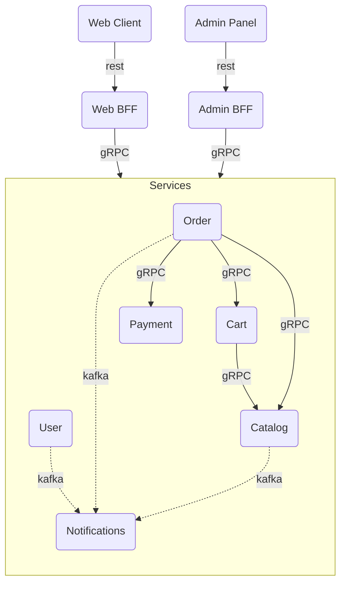

### CartOverflow - Architecture

```mermaid
graph 
    AP(Admin Panel)
    WC(Web Client)
    WBFF(Web BFF)
    ABFF(Admin BFF)
    USR(User)
    ORD(Order)
    CRT(Cart)
    CTG(Catalog)
    NTF(Notifications)
    PAY(Payment)

    subgraph IS [Services]
    direction TB

    USR -. kafka .-> NTF
    ORD -. kafka .-> NTF
    CTG -. kafka .-> NTF

    CRT -- gRPC --> CTG
    ORD -- gRPC --> PAY
    ORD -- gRPC --> CRT
    ORD -- gRPC --> CTG

    end

    WBFF -- gRPC --> IS
    ABFF -- gRPC --> IS
    WC -- rest --> WBFF
    AP -- rest --> ABFF
```